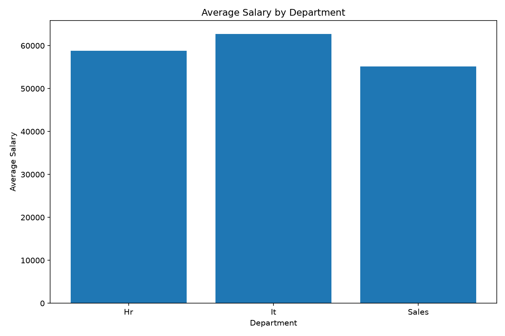

# 🧹 Data Cleaning & Reporting Automation

<p align="center">
  
</p>

> **Automated Python data-cleaning and reporting pipeline that transforms raw employee data into a clean dataset, department-level insights, and an automated report.**

## 📌 Project Overview

This project automates a complete **data cleaning and reporting workflow** using Python. It loads raw employee data, removes duplicate records, standardizes text fields, handles invalid salary values, fills missing emails and dates, generates department-level salary statistics, creates a visualization, and produces an automated text report.

## 🎯 Key Features

- CSV data ingestion using Pandas
- Duplicate record detection and removal
- Text standardization for employee, city, and department fields
- Invalid salary detection and median-based imputation
- Missing email handling
- Date validation and standardization
- Department-level salary analysis
- Automated visualization generation
- Automated text report generation
- Cleaned CSV output

## 📊 Project Results

The supplied run processed **20 employee records** with no duplicate rows removed. Two salary values, one email value, and two invalid/missing dates were handled. The overall average salary after cleaning was **59,300**. fileciteturn2file0L4-L10

### Department Summary

| Department | Employees | Average Salary | Total Salary |
|---|---:|---:|---:|
| HR | 6 | 58,833.33 | 353,000 |
| IT | 8 | **62,750.00** | **502,000** |
| Sales | 6 | 55,166.67 | 331,000 |

IT has the highest average salary and total salary among the three departments. fileciteturn2file0L12-L17

## 🔄 Data Processing Workflow

```text
Raw Employee CSV
       ↓
Load Data with Pandas
       ↓
Remove Duplicates
       ↓
Standardize Text Fields
       ↓
Clean & Impute Salary
       ↓
Handle Missing Email
       ↓
Standardize Dates
       ↓
Create Department Summary
       ↓
Generate Visualization
       ↓
Generate Automated Report
       ↓
Clean CSV + Report + Chart
```

## 🛠️ Technologies

- **Python**
- **Pandas**
- **NumPy**
- **Matplotlib**
- **OpenPyXL**
- **CSV Data Processing**
- **Data Cleaning**
- **Data Analysis**
- **Automated Reporting**

The project requirements include Pandas, NumPy, Matplotlib, and OpenPyXL. fileciteturn2file2L1-L4

## 🧠 Data Cleaning Techniques

The automation script:

- Removes exact duplicate rows.
- Strips whitespace from text columns.
- Standardizes Name, City, and Department capitalization.
- Converts invalid salary values to missing values and fills them using the salary median.
- Replaces missing emails with a defined placeholder.
- Converts dates to datetime and fills invalid/missing dates with a default date.
- Saves the cleaned dataset as CSV. fileciteturn2file1L11-L43

## 📈 Automated Reporting

The script automatically creates:

1. `cleaned_employee_data.csv`
2. `automated_report.txt`
3. `department_summary.png`

The report contains cleaning statistics, overall average salary, and department-level employee and salary summaries. fileciteturn2file0L19-L22

## 📂 Repository Structure

```text
Data-Cleaning-Reporting-Automation/
│
├── data_cleaning_automation.py
├── data_cleaning_reporting.ipynb
├── raw_employee_data.csv
├── cleaned_employee_data.csv
├── automated_report.txt
├── department_summary.png
├── requirements.txt
└── README.md
```

## ▶️ How to Run

### 1. Install dependencies

```bash
pip install -r requirements.txt
```

### 2. Run the automation

```bash
python data_cleaning_automation.py
```

### 3. Generated outputs

```text
cleaned_employee_data.csv
automated_report.txt
department_summary.png
```

## 💼 Recruiter Value

This project demonstrates practical **Data Analyst / Python Automation** skills by converting messy raw data into reliable analytical outputs through a repeatable pipeline.

**Skills demonstrated:** Data Cleaning • Data Transformation • Python • Pandas • Data Analysis • Visualization • Automation • Reporting

## 👨‍💻 Author

**Adnan Hai**  
B.Tech — Artificial Intelligence & Data Science

**Focus Areas:** Data Analytics • Python • Machine Learning • Artificial Intelligence • Business Intelligence

---

⭐ **If you find this project useful, consider starring the repository.**
